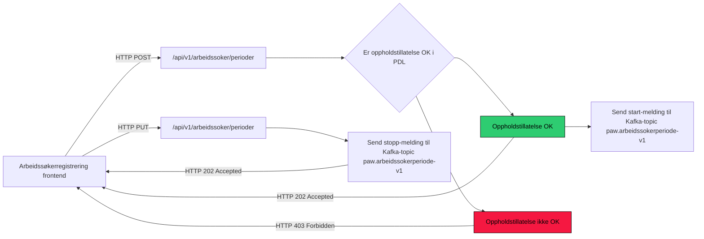

# paw-arbeidssokerregisteret



```
- er postet id lik auth.id
- er auth.id veileder
- er auth.id bruker over 18 aar
- type for siste flytting
- har norsk adresse
- forenklet forlkereg.status
  * "bosattEtterFolkeregisterloven"
  * "ikkeBosatt"
  * "forsvunnet"
  * "doedIFolkeregisteret"
  * "opphoert"
  * "dNummer"
- poa-tilgang: veilleder har tilgang
 
 auth.id er veileder:
   - sjekk tilgang til bruker
   
 auth.id er bruker:
    +(har norsk adresse og oppholdstillatelse)
    +(over 18 aar, norsk addresse, bosattEtterFolkeregisterloven||dNummer)    
    -(bruker under 18 aar)
    -(mangler norsk adresse)
    -(status er en av: 
        *ikkeBosatt
        *forsuvunnet
        *doedIFolkeregisteret
        *opphoert)
    - siste flytting er ikke UT
    
```

## Teknologier

Øvrige teknologier, rammeverk og biblioteker som er blitt tatt i bruk:

- [**Kotlin**](https://kotlinlang.org/)
- [**Ktor**](https://ktor.io/)
- [**PostgreSQL**](https://www.postgresql.org/)
- [**Flyway**](https://flywaydb.org/)
- [**Gradle**](https://gradle.org/)

## Dev oppsett

1) Opprett dolly bruker

Gå til https://dolly.ekstern.dev.nav.no/testnorge og imporer en bruker fra test-norge

2) Opprett dolly bruker som arbeidssøker

Gå til https://arbeid.intern.dev.nav.no/arbeid/registrering og registrer bruker.

Vent litt.

3) Logg inn i tokenx-token-generator med test-id med din nye dolly bruker

Gå til https://tokenx-token-generator.intern.dev.nav.no/api/obo?aud=dev-gcp:paw:paw-arbeidssokerregisteret-api-inngang

* For veiledere:

Logg inn med trygdeetatenbruker på https://azure-token-generator.intern.dev.nav.no/api/obo?aud=dev-gcp:paw:paw-arbeidssokerregisteret-api-inngang

4) Gjør kall mot API-et

Bruk `access_token` i "Token Response" (fra steg 3) til å gjøre forespørsler mot https://periode-arbeidssoekerregisteret.intern.dev.nav.no

Eksempel:

```sh
$ curl -X PUT https://periode-arbeidssoekerregisteret.intern.dev.nav.no/api/v1/arbeidssoker/periode -H 'Authorization: Bearer <access_token>'
-H 'Content-Type: application/json' \
--data-raw '{
  "identitetsnummer": "12345678911",
  "registreringForhaandsGodkjentAvAnsatt": true,
  "periodeTilstand": "STARTET"
}'
```

## Lokalt oppsett

Under er det satt opp et par ting som må på plass for at applikasjonen og databasen skal fungere.

### JDK 21

JDK 21 må være installert. Enkleste måten å installere riktig versjon av Java er ved å
bruke [sdkman](https://sdkman.io/install).

### Docker

`docker` og `docker-compose` må være installert. For å
installere disse kan du følge oppskriften på [Dockers](https://www.docker.com/) offisielle side. For installering på Mac
trykk [her](https://docs.docker.com/desktop/mac/install/) eller
trykk [her](https://docs.docker.com/engine/install/ubuntu/) for Ubuntu.

Man må også installere `docker-compose` som en separat greie
for [Ubuntu](https://docs.docker.com/compose/install/#install-compose-on-linux-systems). For Mac følger dette med når
man installerer Docker Desktop.

Kjør opp docker containerne med

```sh
docker-compose up -d
```

### Gradle properties

Generer et PAT (personal access token) i github [her](https://github.com/settings/tokens).

Gi tokenet minimum read rettigheter -> kopier tokenet -> Autoriser gjennom navikt.

Legg til denne linjen i ```gradle.properties```:

```githubPassword=<github-personal-access-token>```

### App

Start app med `./gradlew run` eller start via intellij

### Autentisering

For å kalle APIet lokalt må man være autentisert med et Bearer token.

Vi benytter mock-oauth2-server til å utstede tokens på lokal maskin. Følgende steg kan benyttes til å generere opp et token:

1. Sørg for at containeren for mock-oauth2-server kjører lokalt (docker-compose up -d)
2. Naviger til [mock-oauth2-server sin side for debugging av tokens](http://localhost:8081/default/debugger)
3. Generer et token
4. Trykk på knappen Get a token
5. Skriv inn noe random i "Enter any user/subject" og pid i optional claims, f.eks.

```json
{ "acr": "Level4", "pid": "18908396568" }
```

For veileder:
```json
{
  "oid": "989f736f-14db-45dc-b8d1-94d621dbf2bb",
  "NAVident": "test"
}
```

For veileder med system-token (husk å legge til `Nav-Ident` i header på request):
```json
{
  "oid": "989f736f-14db-45dc-b8d1-94d621dbf2bb",
  "roles": ["access_as_application"]
}
```

6. Trykk Sign in
7. Kopier verdien for access_token og benytt denne som Bearer i Authorization-header

8. Eksempel:

```sh
$ curl localhost:8080/api/v1/arbeidssoekerperioder -H 'Authorization: Bearer <access_token>'
```

eller benytt en REST-klient (f.eks. [insomnia](https://insomnia.rest/) eller [Postman](https://www.postman.com/product/rest-client/))
