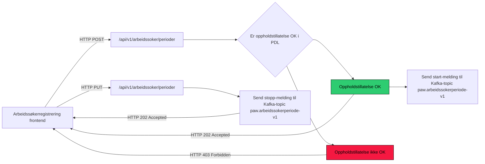

# paw-arbeidssokerregisteret



```
- er postet id lik auth.id
- er auth.id veileder
- er auth.id bruker over 18 aar
- type for siste flytting
- har norsk adresse
- forenklet forlkereg.status
  * "bosattEtterFolkeregisterloven"
  * "ikkeBosatt"
  * "forsvunnet"
  * "doedIFolkeregisteret"
  * "opphoert"
  * "dNummer"
- poa-tilgang: veilleder har tilgang
 
 auth.id er veileder:
   - sjekk tilgang til bruker
   
 auth.id er bruker:
    +(har norsk adresse og oppholdstillatelse)
    +(over 18 aar, norsk addresse, bosattEtterFolkeregisterloven||dNummer)    
    -(bruker under 18 aar)
    -(mangler norsk adresse)
    -(status er en av: 
        *ikkeBosatt
        *forsuvunnet
        *doedIFolkeregisteret
        *opphoert)
    - siste flytting er ikke UT
    
```