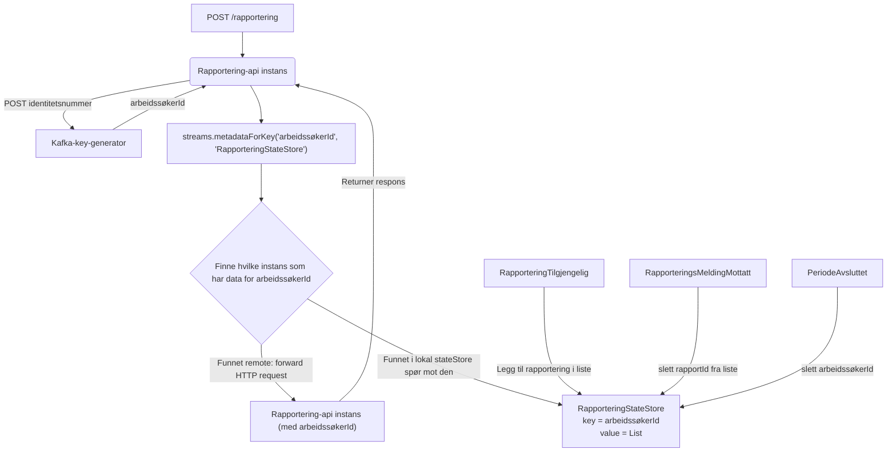

# Bekreftelse API

## Autentisering
Applikasjonen er beskyttet som en **OAuth2 Resource Server** vha **NAV Security Token Validator** fellesbibliotek.

Andre applikasjoner som skal kalle APIet må benytte **OAuth2 Access Token** som **Bearer Token** i kall.

### IDPorten
Ved innlogging av sluttbruker på **Min Side** benyttes **Access Token** fra **IdPorten**.

**NAIS** tilbyr en **Login-Proxy** som benytter session cookie til å slå opp og legge ved Bearer Token i kallet
mot APIet.

NAIS-dokumentasjon:
* [Login-Proxy](https://doc.nais.io/auth/explanations/#login-proxy)
* [IdPorten Auth How-To](https://doc.nais.io/auth/idporten/how-to/login/)
* [IdPorten Auth Reference](https://doc.nais.io/auth/idporten/reference/)

### Entra ID (Azure AD)
### TokenX
