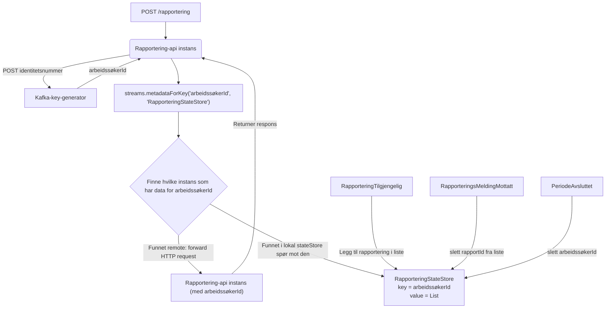

# Bekreftelse API

```mermaid
graph TD
    A[POST /rapportering] --> B(Rapportering-api instans)
    B --> |POST identitetsnummer| C[Kafka-key-generator]
    C -->|arbeidssøkerId| B
    B --> D["streams.metadataForKey('arbeidssøkerId', 'RapporteringStateStore')"]
    D --> E{Finne hvilke instans som har data for arbeidssøkerId}
    E -->|Funnet remote: forward HTTP request| Z["Rapportering-api instans (med arbeidssøkerId)"]
    Z -->|Returner respons| B
    E -->|Funnet i lokal stateStore spør mot den| F[RapporteringStateStore<br>key = arbeidssøkerId<br/>value = List<RapporteringTilgjengelig>]
    G[RapporteringTilgjengelig] -->|Legg til rapportering i liste| F
    H[RapporteringsMeldingMottatt]-->|slett rapportId fra liste|F
    I[PeriodeAvsluttet] --> |slett arbeidssøkerId|F
```