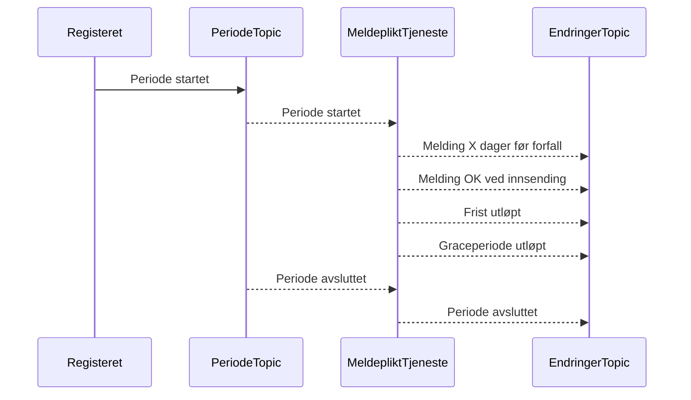
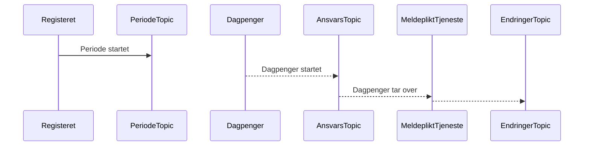
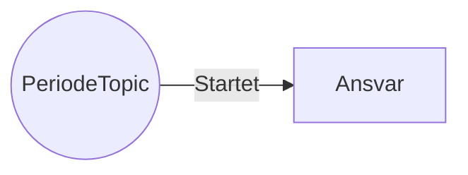

```
 periode topic:
    startet: lagre initiell tilstand
    avsluttet: send ok(avsluttet)
        :slett tilstand
 
 ansvar topic:
    tar ansvar: lagre info om ansvar
        :sett tidspunkt for siste melding til record ts for ansvars endring
    avslutter ansvar: slett info om ansvar
    
 melding topic:
    mottatt: lagre tidspunkt for siste melding
        :send OK(mottatt)
        dersom ikke ønsker å fortsette:
            :send VilAvsluttePerioden
        

 hver x time:
    for alle perioder ingen har ansvar for:
        dersom tid siden siste melding (eller periode start) > Y dager:
            send melding om frist nærmer seg            
        dersom tid siden siste melding (eller periode start) > Z dager:
            send melding om frist utløpt
        dersom tid siden siste melding (eller periode start) > Z+Grace dager:
            send melding om graceperiode utløpt
    for alle perioder andre har ansvar for:
        dersom tid siden siste melding (eller periode start) > Z+G+1dag dager:
            send melding om graceperiode utløpt
                :slett ansvar, vi overtar
```

Modul: endringer til frontend
```
 meldings topic:
   - OK(mottatt) -> sett oppgave fullført
   - OK(avsluttet) -> slett oppgave kansellert
   - OK(ansvar) -> sett oppgave fullført
   - frist nærmer seg -> opprett oppgave
   - frist utløpt -> opprett oppgave
   - graceperiode utløpt -> ingenting   
```

Modul: endringer til eventlogg
```
 meldings topic:
   - VilAvsluttePerioden -> send avslutt hendelse til eventlogg 
   
```
* OK (grunn: RapportMottatt, AnsvarFlyttet, PeriodeAvsluttet)
* 