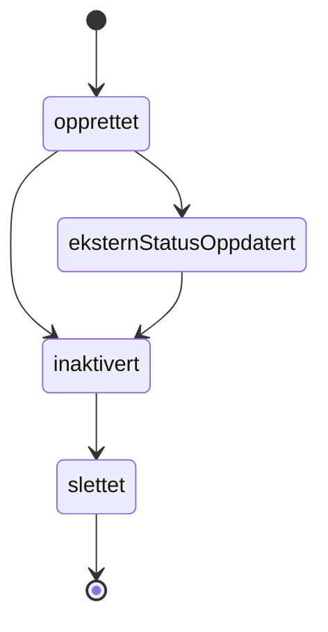
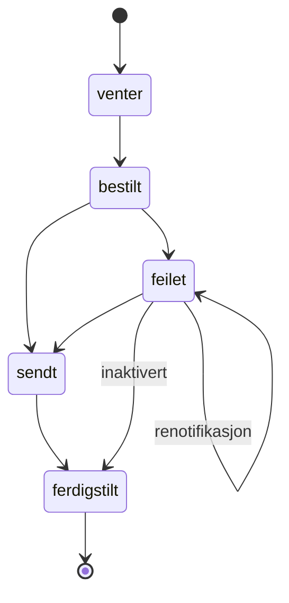

# Min Side Varsler

## Varsler
Team Min Side sin [system-dok](https://navikt.github.io/tms-dokumentasjon)

Varsler opprettes ved å sende en varselmelding på Kafka-topic `min-side.aapen-brukervarsel-v1`.

### Varseltyper
Det finnes tre typer varsler:
* **beskjed** - Enkel informasjon til brukere
* **oppgave** - Brukere må utføre noe
* **innboks** - Varsle om melding i digital innboks

### Varselhendelser
Når tilstand endres for et varsel hos Min Side så opprettes det en varselhendelsemelding på Kafka-topic
`min-side.aapen-varsel-hendelse-v1`.

Det finnes fire typer varselhendelser:
* **opprettet** - TMS har mottat varselmeldingen og lagret den i sin database
* **inaktivert** - Varsel er inaktivert av bruker eller produsent
* **slettet** - Varsel er slettet fra databasen til TMS
* **eksternStatusOppdatert** - Kommer kun om varsel også har blitt send som SMS/Epost, og status for utsending har endret seg

Ved ekstern varsling via SMS/Epost så inneholder varselhendelsen også en status:
* **venter** - Eksternt varsel er klar for utsending
* **bestilt** - Eksternt varsel er oversendt til Altinn
* **sendt** - Eksternt varsel er bekreftet sendt
* **feilet** - Eksternt varsel feilet ved utsending
* **ferdigstilt** - Eksternt varsel er fullført

