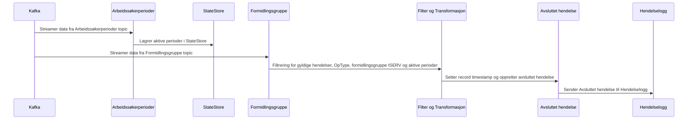

# paw-arbeidssoekerregisteret-utgang-formidlingsgruppe

## Hvordan fungerer det

Denne applikasjonen lytter på hendelser fra formidlingsgruppe topic og sjekker om person har formidlingsgruppe ISERV i Arena.
Dersom person har formidlingsgruppe ISERV sendes en avsluttet hendelse med årsak til hendelselogg.

Den lytter på følgende topics:
- paw.arbeidssokerperioder-v1 (for å hente aktive arbeidssøkerperioder)
- teamarenanais.aapen-arena-formidlingsgruppeendret-v1 (for å hente formidlingsgrupper)

Og sender avsluttet hendelse til:
- paw.arbeidssoker-hendelseslogg-v1

