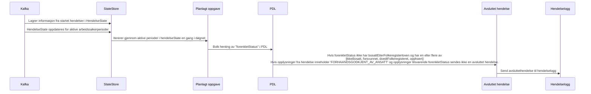

# paw-arbeidssoekerregisteret-pdl-utgang

## Hvordan fungerer det

Denne applikasjonen lytter på hendelser fra Kafka, og henter folkeregisterpersonstatus fra PDL for å sjekke om det finnes grunnlag for å avslutte perioder. 

Dersom det finnes grunnlag for å avslutte en arbeidssøkers periode, sendes en avsluttet hendelse med årsak til hendelselogg.

Den lytter på følgende topics:
- paw.arbeidssoekerperioder-v1 (for å hente aktive arbeidssøkerperioder)
- paw.arbeidssoker-hendelseslogg-v1 (for å hente hendelse informasjon fra startet hendelser)

Og sender avsluttet hendelse til:
- paw.arbeidssoker-hendelseslogg-v1

