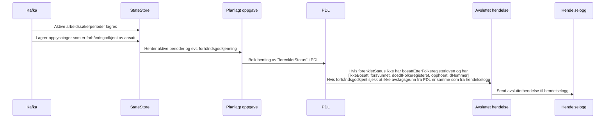

# paw-arbeidssoekerregisteret-pdl-utgang

## Hvordan fungerer det

Denne applikasjonen lytter på hendelser fra Kafka, og henter data fra PDL for å sjekke om en arbeidssøker har avsluttet sin periode. 

Dersom en arbeidssøker har avsluttet sin periode, sendes en hendelse til hendelselogg.

Den lytter på følgende topics:
- paw.arbeidssoekerperioder-v1 (for å hente aktive arbeidssøkerperioder)
- paw.arbeidssoker-hendelseslogg-v1 (for å hente informasjon om forhåndsgodkjente arbeidssøkerperioder)

Og sender avsluttet hendelse til:
- paw.arbeidssoker-hendelseslogg-v1

